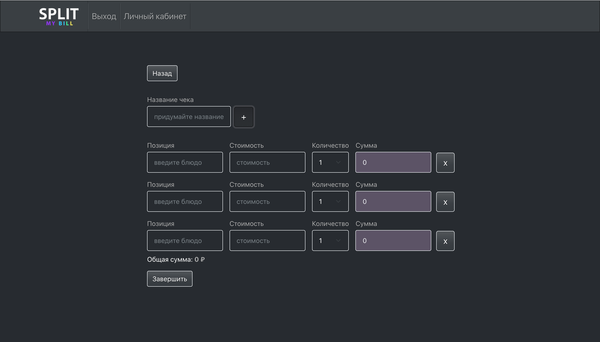
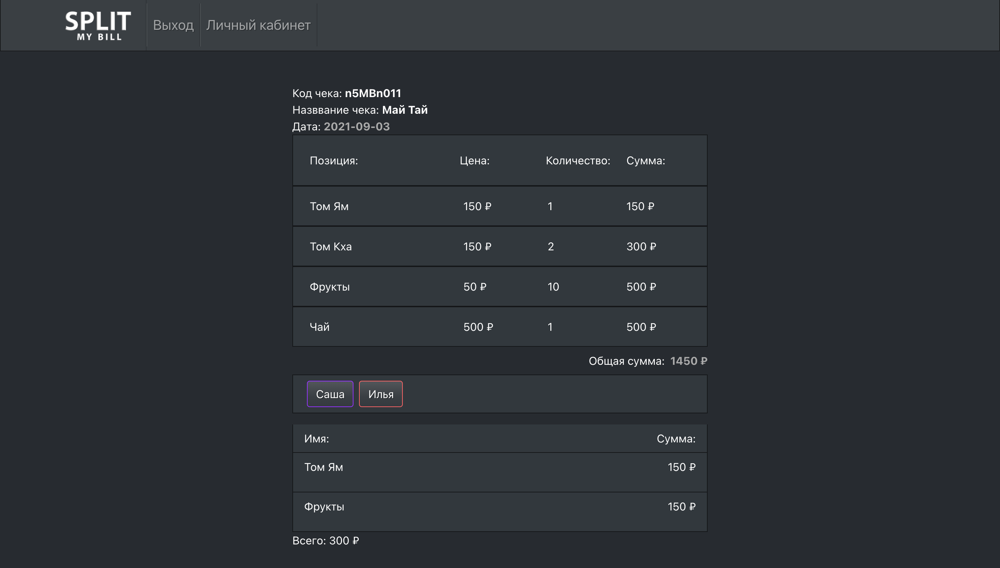
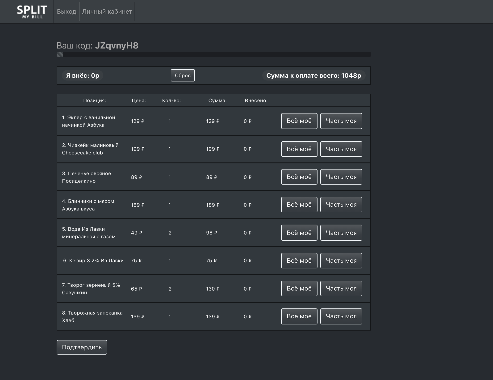

Проект Split My Bill направлен на упрощение процесса разделения счета после ужина в больших компаниях.
Тот, кто оплатил счет, загружает чек, остальные участники ужина подсоединяются по уникальному коду чека. Каждый отмечает свою часть и нажимает подвердить. Последующие участники видят какие блюда уже были оплачены.
Есть два варианта добавление чека: вручную и загрузка изоображения, которая будет распознана с помощью технологии OCR.

В проекте использованы следующие технологии и инструменты:

- OCR Google Vision API
- React + Redux Toolkit
- Bootstrap
- Postgress, Sequelize, Express
- Animate.css
  
  
  
  
  
